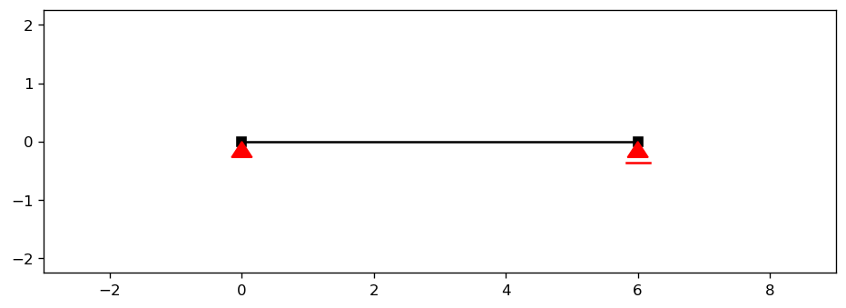
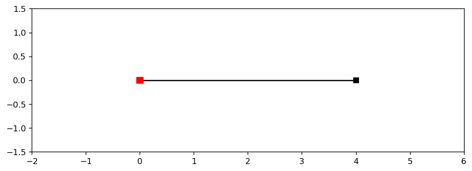
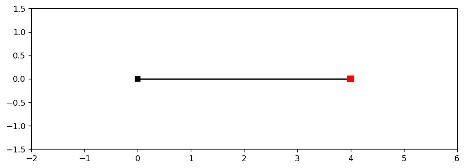
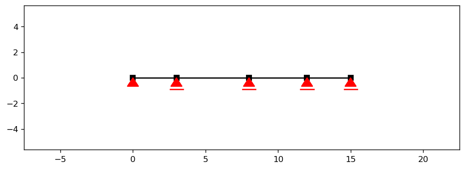
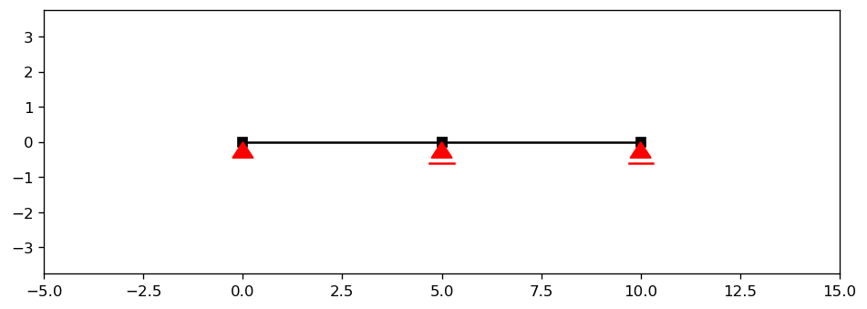
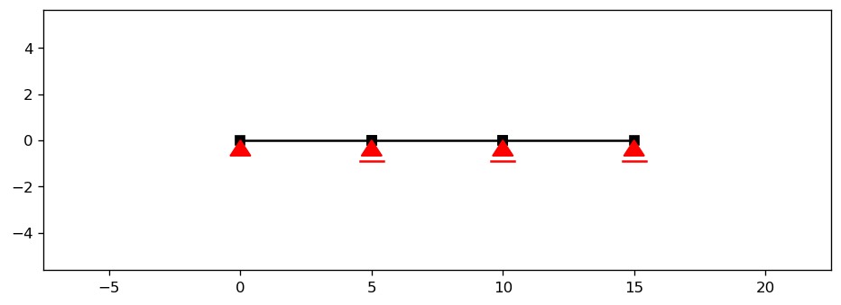
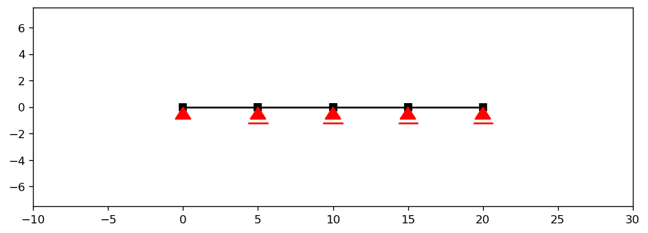
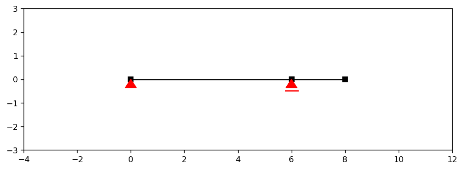
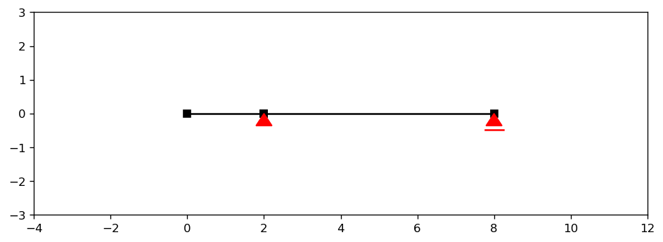

Preprocessing: Beams
====================

The :code:`anastruct.preprocess.beam` module provides ready-made beam generators that automatically
define nodes, elements, and supports for common structural configurations. Instead of building a
model element by element with :code:`SystemElements`, you instantiate a beam type and move straight
to loading and analysis.

Importing
---------

The :code:`beam` module is available at the top level of the :code:`anastruct` package:

.. code-block:: python

    from anastruct import beam

You can also import individual classes or the factory function directly:

.. code-block:: python

    from anastruct.preprocess.beam import SimpleBeam, MultiSpanBeam, create_beam

Once instantiated, every beam exposes its underlying :code:`SystemElements` model as
:code:`beam.system`, giving access to the full suite of analysis and plotting methods.

Section properties
------------------

All beam constructors accept an optional :code:`section` keyword — a dictionary describing
the cross-section. The only required key is :code:`EI` (bending stiffness); the remaining
keys are filled with defaults if omitted:

- :code:`EI` — bending stiffness *(required; default* :code:`1e6` *)*
- :code:`EA` — axial stiffness *(optional; default* :code:`1e8` *)*
- :code:`g` — distributed self-weight per unit length *(optional; default* :code:`0.0` *)*

.. code-block:: python

    # Bending stiffness only — EA and g use defaults
    b = beam.SimpleBeam(length=6.0, section={"EI": 8000})

    # Fully specified
    b = beam.SimpleBeam(length=6.0, section={"EI": 8000, "EA": 1.5e9, "g": 2.5})

If :code:`section` is omitted entirely the beam uses the module defaults listed above.

Single-span beams
-----------------

Simple beam
###########

.. autoclass:: anastruct.preprocess.beam.SimpleBeam

    .. automethod:: __init__

Cantilever beams
################

.. autoclass:: anastruct.preprocess.beam.CantileverBeam

    .. automethod:: __init__

:code:`RightCantileverBeam` and :code:`LeftCantileverBeam` are convenience subclasses that
fix the free end without requiring a :code:`cantilever_side` argument. Each accepts
:code:`length`, :code:`angle`, and :code:`section` only:

.. autoclass:: anastruct.preprocess.beam.RightCantileverBeam

.. autoclass:: anastruct.preprocess.beam.LeftCantileverBeam

Multi-span beams
----------------

Multi-span beams are simply supported, placing a pin at the first support and rollers at all
remaining supports. Spans may be equal or unequal.

.. autoclass:: anastruct.preprocess.beam.MultiSpanBeam

    .. automethod:: __init__

:code:`TwoSpanBeam`, :code:`ThreeSpanBeam`, and :code:`FourSpanBeam` are convenience wrappers
for equal-span multi-span beams. Each accepts :code:`length` (the total length, which is divided
equally), :code:`angle`, and :code:`section`:

.. autoclass:: anastruct.preprocess.beam.TwoSpanBeam

.. autoclass:: anastruct.preprocess.beam.ThreeSpanBeam

.. autoclass:: anastruct.preprocess.beam.FourSpanBeam

Propped beams
#############

A propped beam has one interior simply supported span with a cantilever overhanging one end.

.. autoclass:: anastruct.preprocess.beam.ProppedBeam

    .. automethod:: __init__

:code:`RightProppedBeam` and :code:`LeftProppedBeam` are convenience subclasses that fix
the overhang side. Each accepts :code:`interior_length`, :code:`cantilever_length`,
:code:`angle`, and :code:`section`:

.. autoclass:: anastruct.preprocess.beam.RightProppedBeam

.. autoclass:: anastruct.preprocess.beam.LeftProppedBeam

Factory function
----------------

.. autofunction:: anastruct.preprocess.beam.create_beam

Applying loads
--------------

All beam types share common load application methods. Loads can be applied across all spans at
once, or restricted to a specific span or list of spans by passing a span index (0-indexed) via
the :code:`spans` argument:

.. automethod:: anastruct.preprocess.beam_class.Beam.apply_q_load_to_spans

.. automethod:: anastruct.preprocess.beam_class.Beam.apply_point_load_to_spans

You can also apply loads directly through the underlying :code:`SystemElements` object via
:code:`beam.system`, using the standard methods described in :doc:`loads`.

Examples
--------

Simply supported beam with a uniform distributed load
#####################################################

.. code-block:: python
    :linenos:

    from anastruct import beam

    # 6 m simply supported beam — only EI needs to be specified
    b = beam.SimpleBeam(length=6.0, section={"EI": 8000})

    # 10 kN/m downward load across the full span
    b.apply_q_load_to_spans(q=-10)

    b.system.solve()
    b.show_structure()
    b.system.show_bending_moment()
    b.system.show_displacement()

Three-span beam with a point load on one span
#############################################

Spans can be unequal by supplying :code:`span_lengths` instead of :code:`length`. The
:code:`spans` argument of the load methods targets individual spans by their 0-based index.

.. code-block:: python
    :linenos:

    from anastruct import beam

    # Spans of 4 m, 6 m, and 4 m — indexed 0, 1, 2
    b = beam.MultiSpanBeam(span_lengths=[4.0, 6.0, 4.0], section={"EI": 12000})

    # 50 kN concentrated load at the mid-point of the middle span (index 1)
    b.apply_point_load_to_spans(Fy=-50, relative_location=0.5, spans=1)

    # 2 kN/m dead load on all spans
    b.apply_q_load_to_spans(q=-2)

    b.system.solve()
    b.system.show_bending_moment()
    b.system.show_reaction_force()
