Preprocessing: Trusses
======================

The :code:`anastruct.preprocess.truss` module provides ready-made truss generators for common
structural truss configurations. Geometry — nodes, elements, and supports — is built automatically
from a small set of input parameters, so you can focus on loading and analysis rather than model
construction.

Importing
---------

The :code:`truss` module is available at the top level of the :code:`anastruct` package:

.. code-block:: python

    from anastruct import truss

You can also import individual classes or the factory function directly:

.. code-block:: python

    from anastruct.preprocess.truss import PrattFlatTruss, FinkRoofTruss, create_truss

Once instantiated, every truss exposes its underlying :code:`SystemElements` model as
:code:`truss.system`.

Section properties
------------------

Both flat and roof trusses accept separate section dictionaries for each structural component.
As with beams, only :code:`EI` is required — the other keys are filled with defaults if omitted.
Providing a partial dictionary (e.g. :code:`{"EI": 5000}`) merges with the defaults, so a single
key is always sufficient:

- :code:`top_chord_section` — top chord *(default* :code:`{"EI": 1e6, "EA": 1e8, "g": 0.0}` *)*
- :code:`bottom_chord_section` — bottom chord *(same default)*
- :code:`web_section` — diagonal web members *(same default)*
- :code:`web_verticals_section` — vertical web members *(defaults to* :code:`web_section` *)*

If all section arguments are omitted the truss uses the module defaults throughout.

Flat trusses
------------

Flat trusses have parallel top and bottom chords divided into repeating panel bays. Three web
patterns are available: Howe (diagonals in compression under gravity), Pratt (diagonals in
tension under gravity), and Warren (diagonal-only web, no vertical members).

All flat truss types require three parameters: :code:`width` (total span), :code:`height`
(depth between chords), and :code:`unit_width` (width of each panel bay).

Howe flat truss
###############

.. autoclass:: anastruct.preprocess.truss.HoweFlatTruss

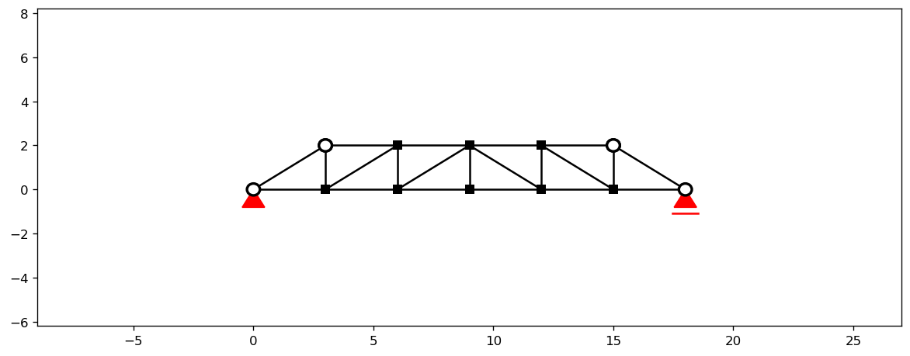

Pratt flat truss
################

.. autoclass:: anastruct.preprocess.truss.PrattFlatTruss

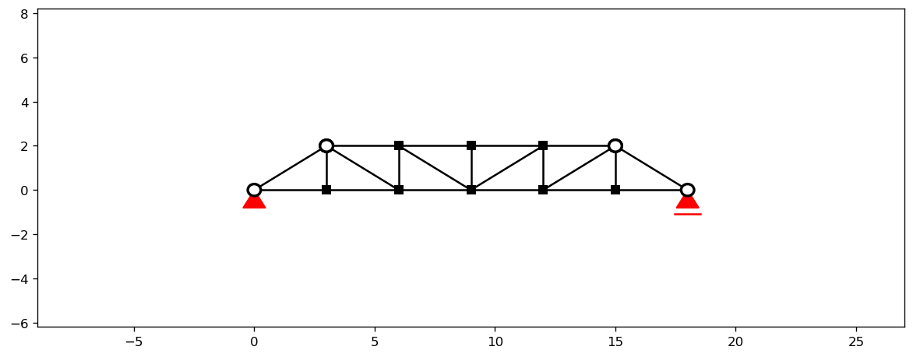

Warren flat truss
#################

.. autoclass:: anastruct.preprocess.truss.WarrenFlatTruss

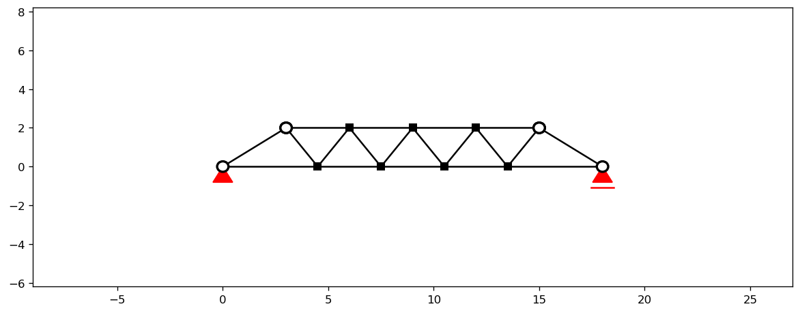

Roof trusses
------------

Roof trusses have sloped top chords meeting at a central peak. The truss height is computed
automatically from :code:`width` and :code:`roof_pitch_deg` — you do not specify it directly.
An optional eave overhang can be added with :code:`overhang_length`.

The two required parameters are :code:`width` (total span) and :code:`roof_pitch_deg` (slope
angle in degrees, between 0 and 90).

.. list-table::
   :widths: 35 15 50
   :header-rows: 1

   * - Class
     - Typical span
     - Description
   * - :code:`KingPostRoofTruss`
     - up to ~8 m
     - Single central vertical (king post); simplest pitched roof truss
   * - :code:`QueenPostRoofTruss`
     - 8–15 m
     - Two verticals at quarter points with diagonal bracing
   * - :code:`FinkRoofTruss`
     - 10–20 m
     - W-shaped web; most common general-purpose roof truss
   * - :code:`HoweRoofTruss`
     - 10–20 m
     - Verticals with diagonals sloping toward the peak (compression)
   * - :code:`PrattRoofTruss`
     - 10–20 m
     - Verticals with diagonals sloping away from the peak (tension)
   * - :code:`FanRoofTruss`
     - 15–25 m
     - Diagonals radiating from lower chord panel points
   * - :code:`ModifiedQueenPostRoofTruss`
     - 12–20 m
     - Enhanced Queen Post with additional web members
   * - :code:`DoubleFinkRoofTruss`
     - 20–30 m
     - Two W patterns for long-span applications
   * - :code:`DoubleHoweRoofTruss`
     - 20–30 m
     - Enhanced Howe for long spans or heavy loading
   * - :code:`ModifiedFanRoofTruss`
     - 20–30 m
     - Enhanced Fan with additional web members
   * - :code:`AtticRoofTruss`
     - any
     - Room-in-roof truss with habitable attic space

King Post
#########

.. autoclass:: anastruct.preprocess.truss.KingPostRoofTruss

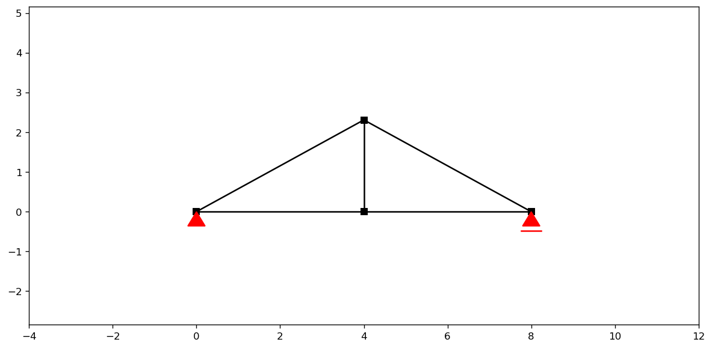

Queen Post
##########

.. autoclass:: anastruct.preprocess.truss.QueenPostRoofTruss

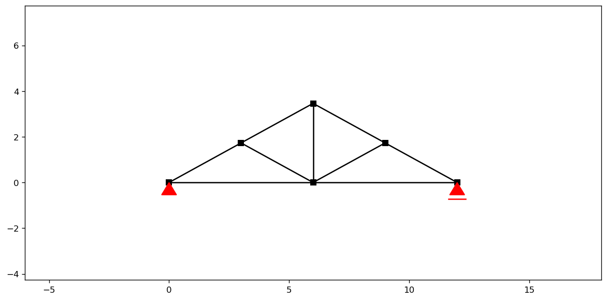

Fink
####

.. autoclass:: anastruct.preprocess.truss.FinkRoofTruss

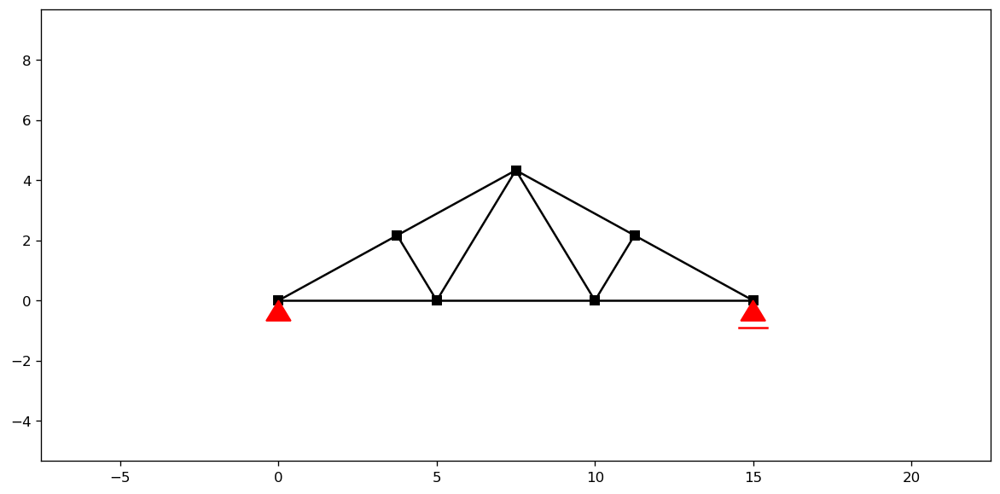

Howe
####

.. autoclass:: anastruct.preprocess.truss.HoweRoofTruss

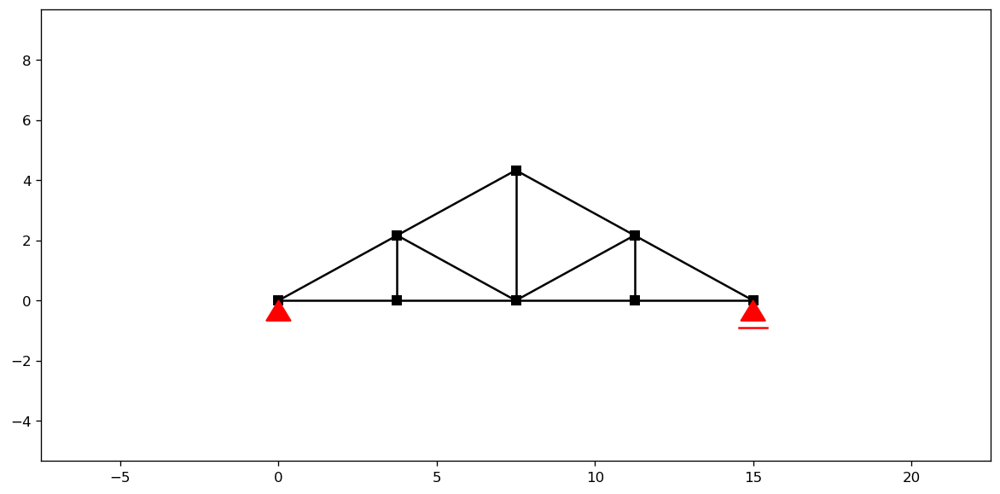

Pratt
#####

.. autoclass:: anastruct.preprocess.truss.PrattRoofTruss

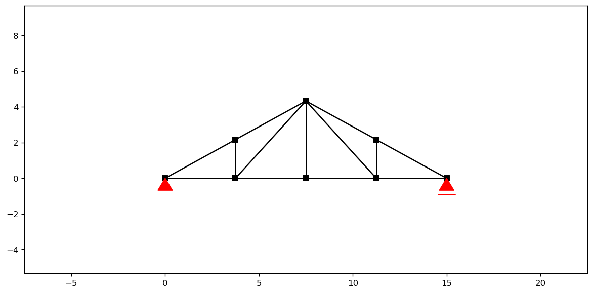

Fan
###

.. autoclass:: anastruct.preprocess.truss.FanRoofTruss

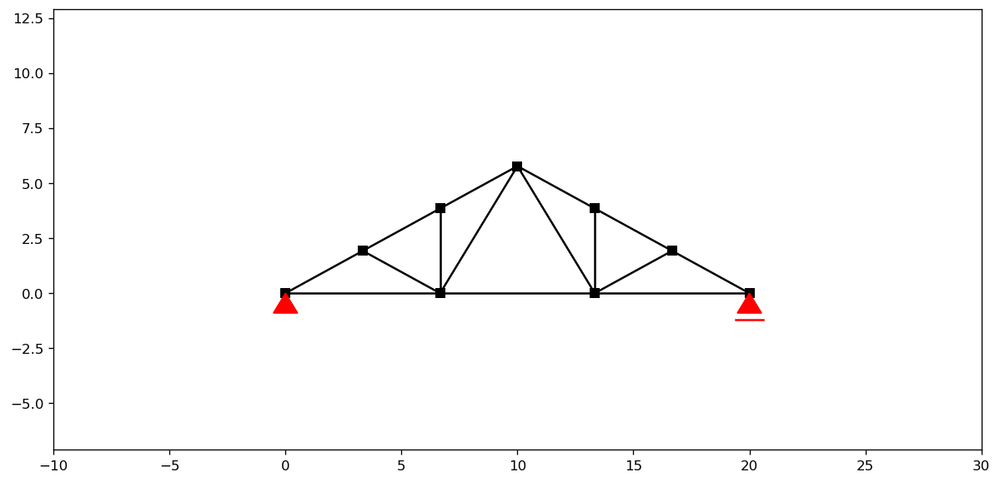

Modified Queen Post
###################

.. autoclass:: anastruct.preprocess.truss.ModifiedQueenPostRoofTruss

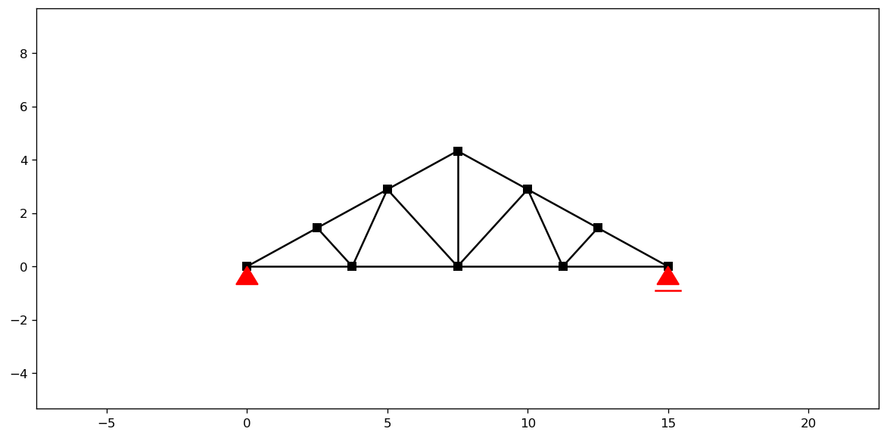

Double Fink
###########

.. autoclass:: anastruct.preprocess.truss.DoubleFinkRoofTruss

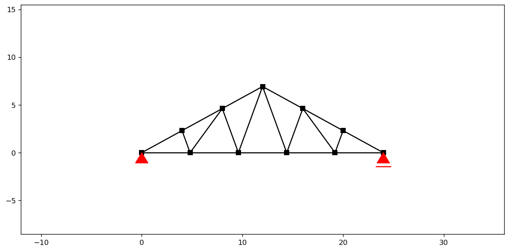

Double Howe
###########

.. autoclass:: anastruct.preprocess.truss.DoubleHoweRoofTruss

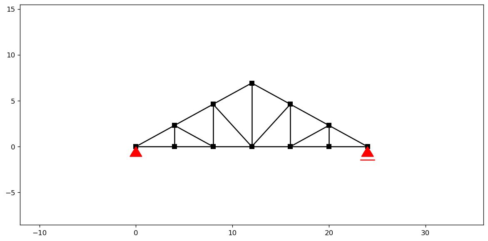

Modified Fan
############

.. autoclass:: anastruct.preprocess.truss.ModifiedFanRoofTruss

Attic (room-in-roof) truss
##########################

The attic truss creates vertical walls and a flat ceiling to provide usable space beneath
the roof. It requires two additional parameters beyond the standard roof truss inputs:
:code:`attic_width` (interior floor width, which must be less than the total :code:`width`)
and an optional :code:`attic_height` (ceiling height; if omitted it defaults to the height
where the vertical walls naturally meet the sloped top chord).

.. autoclass:: anastruct.preprocess.truss.AtticRoofTruss

    .. automethod:: __init__

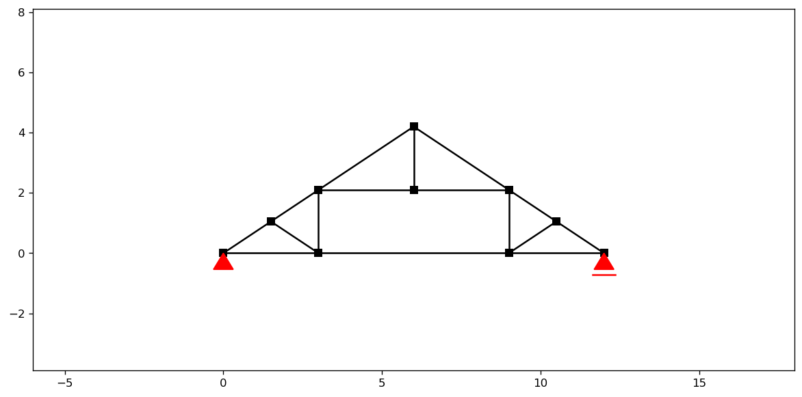

Factory function
----------------

.. autofunction:: anastruct.preprocess.truss.create_truss

Applying loads
--------------

Distributed loads can be applied to the full top or bottom chord in a single call:

.. automethod:: anastruct.preprocess.truss_class.Truss.apply_q_load_to_top_chord

.. automethod:: anastruct.preprocess.truss_class.Truss.apply_q_load_to_bottom_chord

For roof trusses the top chord is segmented into :code:`"left"` and :code:`"right"` slopes.
Passing :code:`chord_segment="left"` or :code:`chord_segment="right"` restricts the load to
one slope; omitting the argument applies it to both.

Point loads and element-level loads can be applied through :code:`truss.system` using the
standard methods described in :doc:`loads`.

Examples
--------

Pratt flat truss with a distributed roof load
#############################################

.. code-block:: python
    :linenos:

    from anastruct import truss

    # 18 m span, 2 m deep, 3 m panel bays
    # Providing only EI for each chord — EA and g use defaults
    t = truss.PrattFlatTruss(
        width=18.0,
        height=2.0,
        unit_width=3.0,
        top_chord_section={"EI": 5000},
        web_section={"EI": 100},
    )

    # 10 kN/m downward load applied vertically along the top chord
    t.apply_q_load_to_top_chord(q=-10, direction="y")

    t.system.solve()
    t.show_structure()
    t.system.show_axial_force()
    t.system.show_displacement()

Fink roof truss with wind load
##############################

For roof trusses the peak height is derived from the pitch: a 30° pitch on a 12 m span gives
a peak at 6 × tan(30°) ≈ 3.46 m. Wind load is commonly applied perpendicular to the slope
using :code:`direction="element"`.

.. code-block:: python
    :linenos:

    from anastruct import truss

    # 12 m span at 30° pitch — height computed automatically
    t = truss.FinkRoofTruss(
        width=12.0,
        roof_pitch_deg=30,
        top_chord_section={"EI": 8000, "EA": 2e8},
        bottom_chord_section={"EI": 8000, "EA": 2e8},
        web_section={"EI": 100, "EA": 8e7},
    )

    # 2 kN/m wind load perpendicular to each top-chord slope
    t.apply_q_load_to_top_chord(q=-2, direction="element")

    t.system.solve()
    t.show_structure()
    t.system.show_bending_moment()
    t.system.show_reaction_force()
